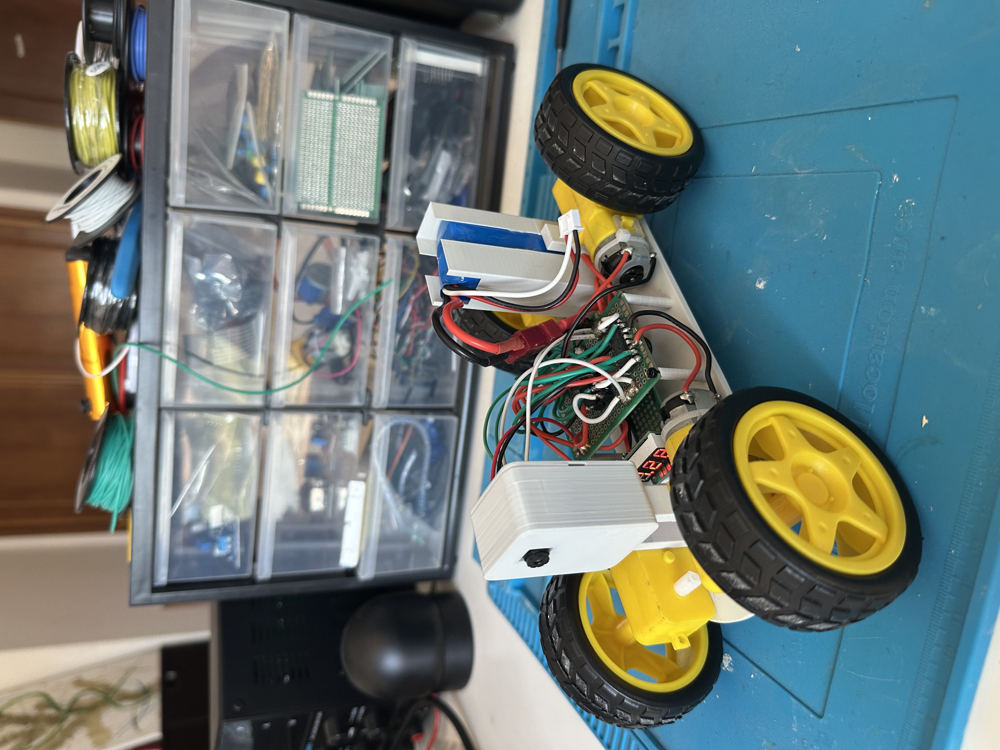
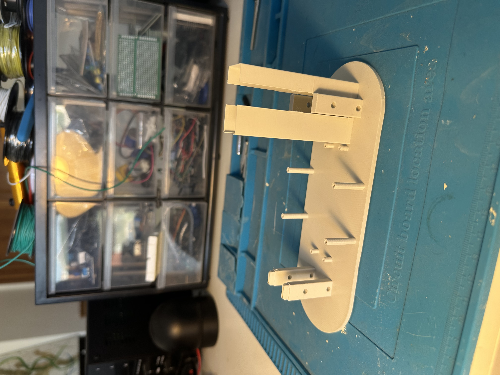
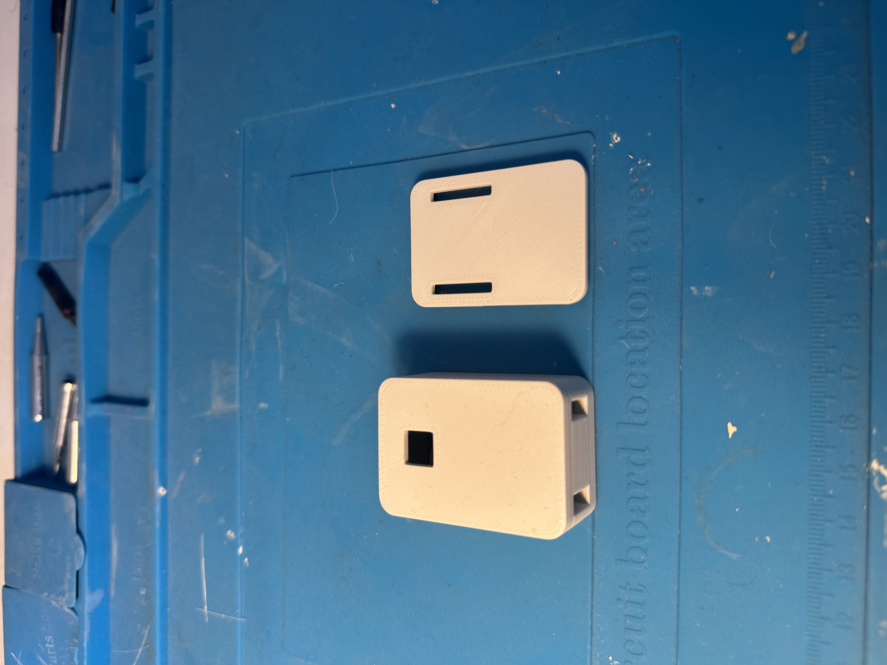
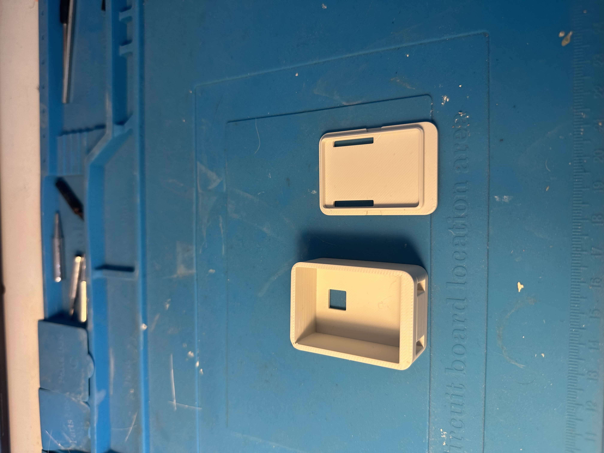

# ESP32-CAM RC Car

A remote-controlled car built on the AI-Thinker ESP32-CAM: live video streaming and gamepad control over WiFi, driven from a PC.



## What it does

On boot, the ESP32 reads the WiFi networks stored in its flash (NVS) and scans the networks on the air. It matches them and connects to the strongest known one. If no stored network is in range, it falls back to **Access Point mode**: it creates its own network (`ESP32_CAM_AFONSO`), and you send it credentials with a TCP tool like Packet Sender (`WIFI:ssid,password`). It saves them to flash and restarts, so the next boot connects normally.

Once online, the car connects out to two Python servers running on the PC: one for control commands, one for the camera stream.

## Architecture

The ESP32 has two cores and the firmware uses both, so heavy video never blocks the driving:

- **Core 0** runs the camera task: captures JPEG frames from the OV2640 and streams them to the PC (port 1884).
- **Core 1** runs the main loop: receives `MOV:x,DIR:y` commands over TCP (port 1883) and drives the motors.

The ESP32 is always the **client** — it opens both connections. The PC runs two servers that wait for it:

- `server/comandos.py` — reads an Xbox gamepad (pygame) and sends movement/steering commands.
- `server/camara.py` — receives the JPEG frames and displays them (OpenCV).

A heartbeat keeps the link alive: if commands go silent for 1 s the motors stop, for 5 s the connection is dropped and reopened. If WiFi is lost for 10 s the chip restarts.

## Hardware

- AI-Thinker ESP32-CAM (ESP32-S + OV2640)
- 2 L293D H-bridge (four DC motors)
- 3D-printed chassis (see `hardware/`)
- 7.4 V LiPo battery + 5 V regulator

## Build



Printed chassis: battery holder, screw mounts for the protoboards, and mounts for the ESP32-CAM housing.



ESP32-CAM housing and cover (front).



Housing and cover (back).


*(demo video link)*

## How to use

**Firmware**
1. Install the ESP32 board package in Arduino IDE (Boards Manager → "esp32" by Espressif). Board: **AI Thinker ESP32-CAM**.
2. Open `firmware/main/main.ino`. Edit `config.h` and set your PC IP and AP credentials.
3. Upload to the ESP32.

**PC servers**
1. Run `python server/comandos.py` (needs pygame) and `python server/camara.py` (needs opencv-python, numpy).
2. Power the car. It connects automatically.

**Network**
- **Same network (local):** set `DESTINO_IP` in `config.h` to the PC's private IP (`192.168.x.x`). Lowest latency.
- **Over the internet:** forward ports **1883** and **1884** (TCP) on the router to the PC, and set `DESTINO_IP` to the router's public IP.
  - Note: if the car and the PC are on the *same* network but you use the public IP, many routers won't route it back inside (no NAT loopback). Use the private IP in that case.

## Known limitations

- **WiFi range.** The ESP32-CAM's on-board antenna is weak. Far from the router the link degrades, and a long enough dropout restarts the chip. An external antenna (via the u.FL connector, if the board has one) helps a lot.
- **Power.** Camera + WiFi draw current spikes; an undersized regulator can brown out and reset the chip. A large capacitor across the 5 V input helps.

## Repository layout

```
firmware/main/   ESP32 firmware (main.ino) + config.h
server/          Python servers (comandos.py, camara.py)
hardware/        3D chassis (STL to print, F3D source)
docs/            photos, schematic
```
