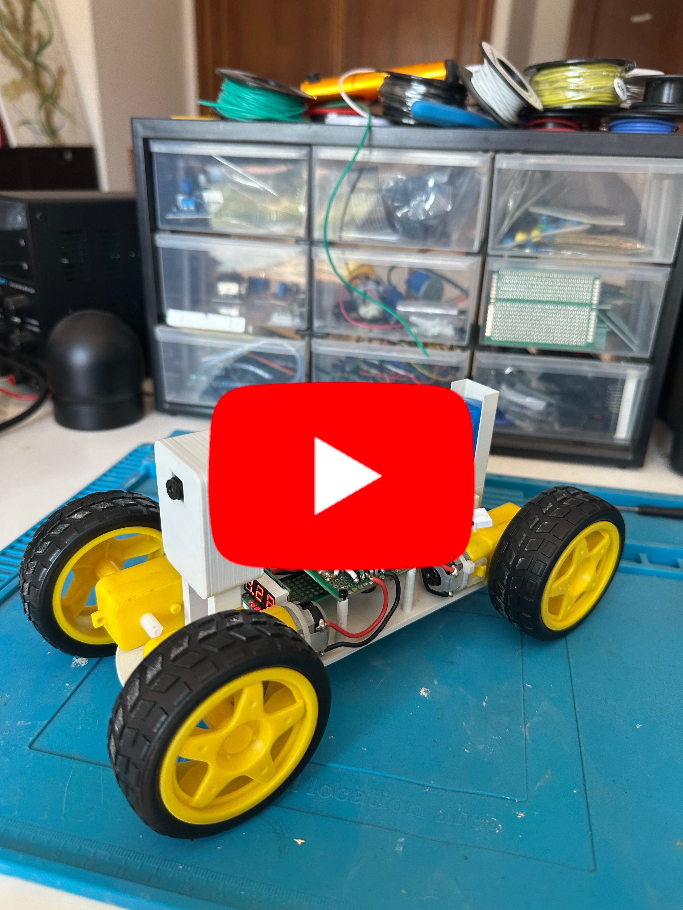
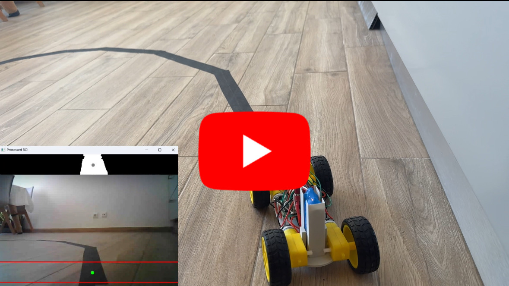

# ESP32-CAM RC Car

A remote-controlled car built on the AI-Thinker ESP32-CAM: live video streaming and gamepad control over WiFi, plus an autonomous line-following mode driven by computer vision on the PC.

<div align="center"></div>

## What it does

The car has two modes, toggled with the gamepad:

- **Manual** — drive it with an Xbox controller over WiFi.
- **Autonomous line following** — the PC analyses the camera stream, finds a line on the floor, and steers the car along it on its own.

On boot, the ESP32 reads the WiFi networks stored in its flash (NVS) and scans the air. It connects to the strongest known one. If no stored network is in range, it falls back to **Access Point mode**: it creates its own network (name set in `config.h`), and you send it credentials with a TCP tool like Packet Sender (`WIFI:ssid,password`). It saves them to flash and restarts.

## Architecture

The ESP32 stays "dumb" on purpose: it captures and sends frames, receives commands, and drives the motors. All the thinking happens on the PC.

**On the ESP32 (two cores, so heavy video never blocks driving):**
- **Core 0** captures JPEG frames from the OV2640 and streams them to the PC over **UDP** (port 1884).
- **Core 1** receives `MOV:x,DIR:y` commands over TCP (port 1883) and drives the motors.

**On the PC (`server/unified_python_server.py`), three threads:**
- **Receive** — reads UDP video packets and reassembles each JPEG frame, keeping only the most recent one.
- **Processing** — runs the vision pipeline (grayscale, threshold, morphology, contours), finds the line's centre, computes steering, and runs the follow/recovery state machine.
- **Main** — reads the gamepad and sends commands to the car.

**Why UDP for video:** with live video you want the *freshest* frame, not a backed-up queue of old ones. TCP resends lost packets and everything waits; UDP drops a lost frame and moves on. A JPEG frame is reassembled from packets using its start/end markers (`FF D8` / `FF D9`).

A heartbeat keeps the link alive: if commands go silent for 1 s the motors stop, for 5 s the connection is dropped and reopened. If WiFi is lost for 10 s the chip restarts.

## Line following

The vision pipeline, per frame:
1. **Grayscale** — colour doesn't matter, only dark vs light.
2. **ROI** — crop a strip near the bottom (the floor in front of the car), so walls and furniture don't interfere.
3. **Threshold** — separate the line from the floor (adaptive threshold handles uneven lighting).
4. **Morphology** — clean up noise.
5. **Contours** — find the line, filter out reflections and floor patches by size/shape, pick the right one.
6. **Centre + error** — the line's horizontal centre vs the image centre gives the steering error.
7. **Proportional control** — steering is proportional to the error.

A small **state machine** handles losing the line: normal follow, and a recovery state that reverses to bring the line back into view when it disappears in a sharp curve.

## Hardware

- AI-Thinker ESP32-CAM (ESP32-S + OV2640)
- 2× L293D H-bridges (four DC motors, two per side)
- 3D-printed chassis (see `hardware/`)
- 7.4 V LiPo battery + 5 V regulator

## Build

<div align="center">
  <br>
  <em>Printed chassis: battery holder, screw mounts for the protoboards, and mounts for the ESP32-CAM housing.</em>
</div>

<br>

<div align="center">
  <br>
  <em>ESP32-CAM housing and cover (front).</em>
</div>

<br>

<div align="center">
  <br>
  <em>Housing and cover (back).</em>
</div>

## Demo

**Manual control**

<div align="center"><a href="https://www.youtube.com/watch?v=0vkdqZmBMSo"></a></div>

**Autonomous line following**

<div align="center"><a href="https://www.youtube.com/watch?v=jG8YLj0yXlU"></a></div>

## How to use

**Firmware**
1. Install the ESP32 board package in Arduino IDE (Boards Manager → "esp32" by Espressif). Board: **AI Thinker ESP32-CAM**.
2. Open `firmware/main/main.ino`. Edit `config.h` and set your PC IP and AP credentials.
3. Upload to the ESP32.

**PC server**
1. Run `python server/unified_python_server.py` (needs opencv-python, numpy, pygame).
2. Power the car. It connects automatically.
3. Press the gamepad button to toggle between manual and line-following modes.

**Network**
- **Same network (local):** set `DESTINO_IP` in `config.h` to the PC's private IP (`192.168.x.x`). Lowest latency.
- **Over the internet:** forward ports **1883** (TCP) and **1884** (UDP) on the router to the PC, and set `DESTINO_IP` to the router's public IP.
  - Note: if the car and PC are on the *same* network but you use the public IP, many routers won't route it back inside (no NAT loopback). Use the private IP in that case.

## Tuning (important — read this)

The line follower is **not plug-and-play**. The parameters at the top of `unified_python_server.py` must be adjusted to **your** floor, tape, lighting, and car. Key ones:

- **Tape and floor contrast.** The line must stand out from the floor in brightness. Dark tape on a light floor works; matte tape and a non-reflective floor avoid the light-reflection problems that plagued early tests (reflections read as near-white and confuse detection).
- **Threshold / block size.** Adjust so the processed view shows a clean solid line, no floor patches, no holes.
- **GAIN, DEADBAND.** Steering response — raise GAIN if it doesn't turn enough, lower it if it snakes.
- **ROI height.** How far ahead the car looks.

**Battery note:** motor behaviour depends on battery charge. The minimum duty a motor needs to turn is **higher on a low battery** than on a full one — the same value sent to the enable pin does *not* produce the same motion as the battery drains. Speed parameters may need adjusting as the battery discharges.

## Known limitations

- **Turning radius.** The car is differential-drive with shared direction pins (both L293Ds share IN pins), so it can't pivot in place. Sharp curves can exceed its turning ability; the recovery state (reversing) helps but doesn't fully solve very tight turns.
- **WiFi range.** The ESP32-CAM's on-board antenna is weak. Far from the router the link degrades. An external antenna (via the u.FL connector, if present) helps a lot.
- **Power.** Camera + WiFi draw current spikes; an undersized regulator can brown out and reset the chip. A large capacitor across the 5 V input helps.

## Repository layout

```
firmware/main/   ESP32 firmware (main.ino) + config.h
server/          unified_python_server.py (video + control + line following)
hardware/        3D chassis (STL to print, F3D source)
docs/            photos, thumbnails
```
