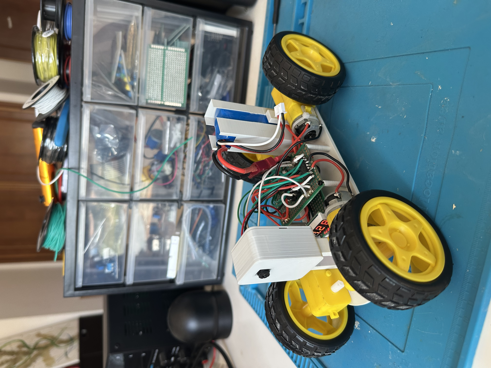
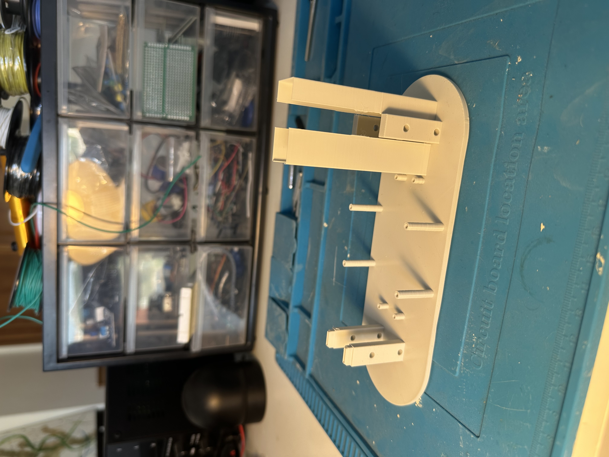
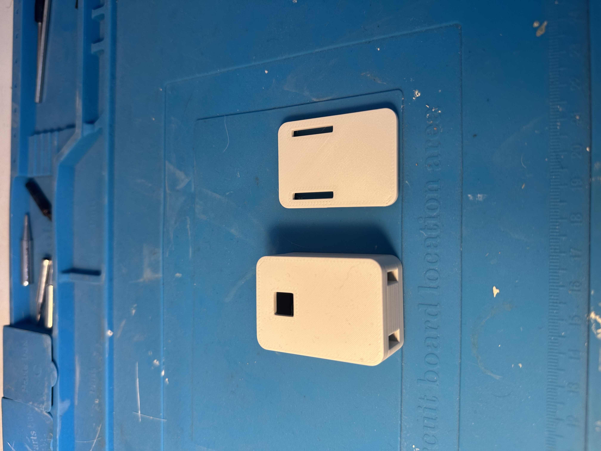
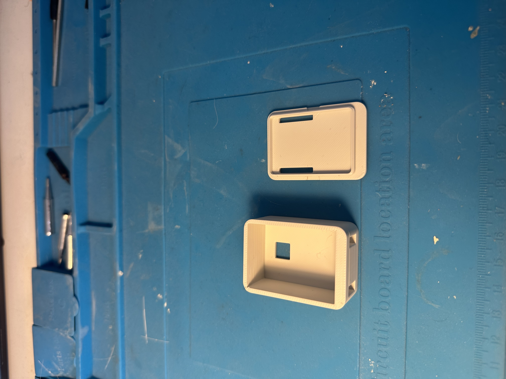
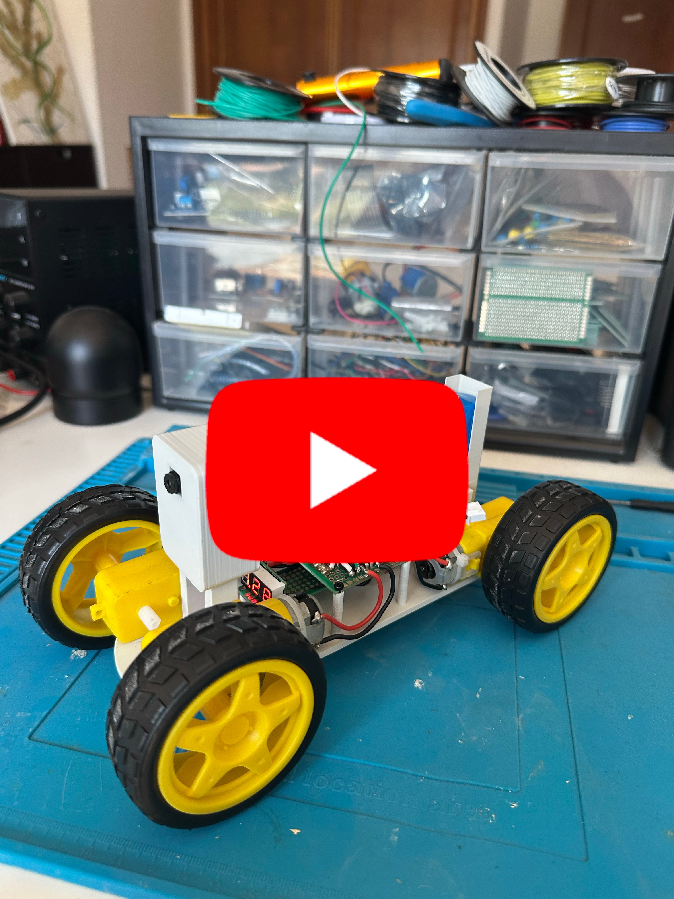
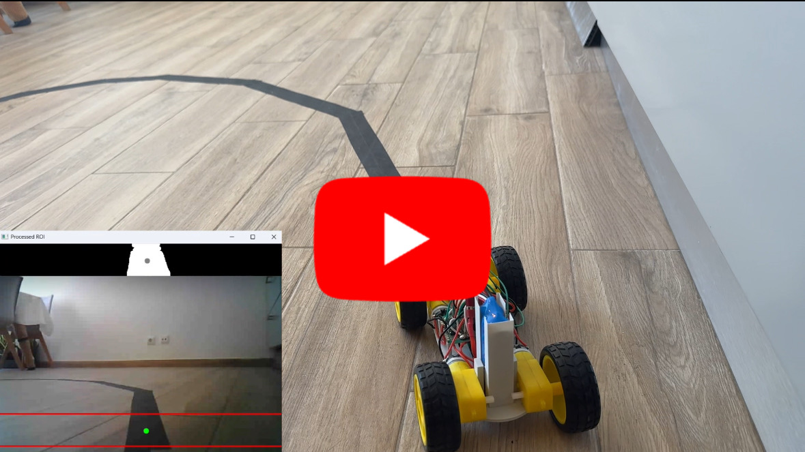

# ESP32-CAM RC Car

A remote-controlled car built on the AI-Thinker ESP32-CAM: live video streaming and gamepad control over WiFi, plus an autonomous line-following mode driven by computer vision on the PC.

<div align="center"></div>

## What it does

The car has two modes, toggled with the gamepad:

- **Manual** — drive it with an Xbox controller over WiFi.
- **Autonomous line following** — the PC analyses the camera stream, finds a line on the floor, and steers the car along it on its own.

On boot, the ESP32 reads the WiFi networks stored in its flash (NVS) and scans the air. It connects to the strongest known one. If no stored network is in range, it falls back to **Access Point mode**: it creates its own network (name set in `config.h`), and you send it credentials with a TCP tool like Packet Sender (`WIFI:ssid,password`). It saves them to flash and restarts.

## Architecture

The ESP32 captures camera frames, receives validated control commands, and drives the motors. The PC handles the gamepad and computer-vision decisions.

**ESP32:**

- Core 0 sends JPEG camera frames to the PC over UDP port `1884`.
- Core 1 receives motor commands over UDP port `1883`.
- TCP port `1883` remains available only in Access Point configuration mode for receiving WiFi credentials.

**PC (`server/unified_python_server - UDP.py`):**

- The discovery thread receives `HELLO:1` and learns the ESP32 address from the UDP packet source.
- The video thread receives and decodes camera frames.
- The processing thread calculates autonomous movement and steering.
- The main loop sends the complete current control state every `50 ms`.

The ESP32 announces itself every second with `HELLO:1`.

The PC responds with `CMD:1,<session>,<sequence>,<move>,<direction>`.

Only strictly valid and current packets from the IP configured in `DESTINO_IP` are applied. Duplicate, old, malformed, oversized, and wrong-version packets are rejected.

If no valid command arrives for `500 ms`, the ESP32 stops the motors. Losing WiFi also stops them immediately.

Source-IP filtering is not cryptographic authentication. The control channel is intended for a trusted local network.

**Video limitation:** a complete JPEG is still sent as one UDP datagram. Large frames may be fragmented by IP, so application-level video fragmentation remains separate work.

## Line following

The vision pipeline, per frame:
1. **Grayscale** — colour doesn't matter, only dark vs light.
2. **ROI** — crop a strip near the bottom (the floor in front of the car), so walls and furniture don't interfere.
3. **Threshold** — separate the line from the floor (adaptive threshold handles uneven lighting).
4. **Morphology** — clean up noise.
5. **Contours** — find the line, filter out reflections and floor patches by size/shape, pick the right one.
6. **Centre + error** — the line's horizontal centre vs the image centre gives the steering error.
7. **Proportional control** — steering is proportional to the error.

A small **state machine** handles losing the line: normal follow, and a recovery state that reverses to bring the line back into view when it disappears in a sharp curve.

## Hardware

- AI-Thinker ESP32-CAM (ESP32-S + OV2640)
- 2× L293D H-bridges (four DC motors, two per side)
- 3D-printed chassis (see `hardware/`)
- 7.4 V LiPo battery + 5 V regulator

## Build

<div align="center">
  <br>
  <em>Printed chassis: battery holder, screw mounts for the protoboards, and mounts for the ESP32-CAM housing.</em>
</div>

<br>

<div align="center">
  <br>
  <em>ESP32-CAM housing and cover (front).</em>
</div>

<br>

<div align="center">
  <br>
  <em>Housing and cover (back).</em>
</div>

## Demo

**Manual control**

<div align="center"><a href="https://www.youtube.com/watch?v=0vkdqZmBMSo"></a></div>

**Autonomous line following**

<div align="center"><a href="https://www.youtube.com/watch?v=jG8YLj0yXlU"></a></div>

## How to use

### Firmware

1. Install the Espressif ESP32 board package.
2. Select **AI Thinker ESP32-CAM**.
3. Edit `firmware/main/config.h`.
4. Set `DESTINO_IP` to the PC's private LAN address.
5. Configure the Access Point credentials.
6. Compile and upload the firmware.

Command-line compilation uses `arduino-cli compile --fqbn esp32:esp32:esp32cam firmware/main`.

`DESTINO_IP` is machine-specific and may change. Do not commit a personal local IP as the project default.

### PC server

Create and activate a Python virtual environment, then install `numpy`, `opencv-python`, and `pygame`.

Start the server with `python "server/unified_python_server - UDP.py"`.

Power the car after starting the server. The ESP32 sends `HELLO:1`, the PC discovers its address, and UDP control begins automatically.

Use the configured gamepad button to toggle between manual and autonomous line-following modes.

### Network

The PC and ESP32 must be connected to the same trusted local network.

- UDP port `1883` carries discovery and motor-control messages.
- UDP port `1884` carries camera video.
- TCP port `1883` is used only while the ESP32 is in Access Point configuration mode.

With default WSL2 NAT networking, the ESP32 normally cannot directly reach a server running only inside WSL. For the first physical test, run the Python server natively on Windows and set `DESTINO_IP` to the Windows WiFi address.

Do not expose the UDP control ports directly to the Internet. Source-IP filtering is not strong authentication.

## Tuning (important — read this)

The line follower is **not plug-and-play**. The parameters in `server/unified_python_server - UDP.py` must be adjusted to **your** floor, tape, lighting, and car. Key ones:

- **Tape and floor contrast.** The line must stand out from the floor in brightness. Dark tape on a light floor works; matte tape and a non-reflective floor avoid the light-reflection problems that plagued early tests (reflections read as near-white and confuse detection).
- **Threshold / block size.** Adjust so the processed view shows a clean solid line, no floor patches, no holes.
- **GAIN, DEADBAND.** Steering response — raise GAIN if it doesn't turn enough, lower it if it snakes.
- **ROI height.** How far ahead the car looks.

**Battery note:** motor behaviour depends on battery charge. The minimum duty a motor needs to turn is **higher on a low battery** than on a full one — the same value sent to the enable pin does *not* produce the same motion as the battery drains. Speed parameters may need adjusting as the battery discharges.

## Known limitations

- **UDP video framing.** A JPEG is currently sent as one large UDP datagram. IP fragmentation makes large frames fragile; application-level fragmentation still needs to be implemented.
- **No cryptographic control authentication.** Commands are restricted to `DESTINO_IP`, but source-IP filtering alone does not protect against a capable attacker on the local network.
- **Turning radius.** The car uses differential drive with shared direction pins, so it cannot pivot in place.
- **WiFi range.** The ESP32-CAM's on-board antenna is weak. An external antenna can improve its range.
- **Power.** Camera and WiFi activity cause current spikes. An undersized regulator can brown out and reset the ESP32.

## Repository layout

```text
firmware/main/                   ESP32 firmware and UDP protocol parser
server/control_protocol.py      Python UDP protocol encoder
server/unified_python_server - UDP.py
                                Video, control and line-following server
tests/                          Python and host-side C++ tests
hardware/                       3D chassis files
docs/                           Photos and documentation
```
